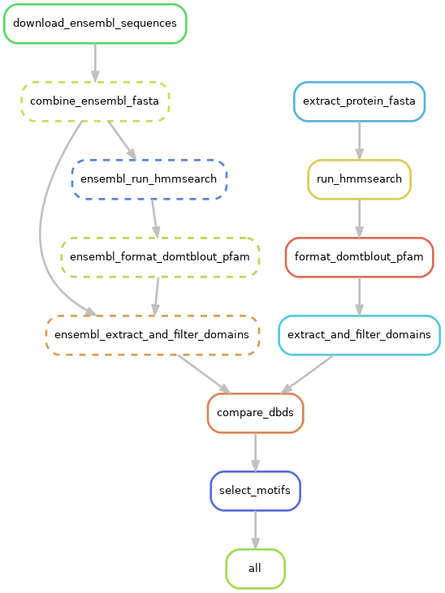

# dbd_comparison
Repository for comparing DNA Binding Sites for motif selection

## Workflow

This workflow looks to compare DNA binding domains between a query species of specified proteins (e.g. PMC TFs in _lytechinus variegatus_) to possible orthologues in other species in order to determine candidate binding motifs for the query species. The general workflow follows steps outline here:

1. Extract protein amino acids for TFs of interest
2. Annotate each protein sequenc for PFAM domains using HMMER
3. Filter HMMER output to remove overlapped/redundant protein domains, domains with high e-values, and non-DBD domains
4. Match query sequences to UNIPROT orthologues using genome annotations.
5. Download sequences for all orthologues using BioMaRT and ENSEMBL.
6. Repeat 1-3 for orthologous sequences in other species
7. Compare DBD sequences between orthologues in query species (lv) and all other target species (ensembl sequences)
8. Match TF binding motifs to query proteins if a DBD from the given protein has > 70 percent identity with the given orthologous protein.





## Installation

To install the pipeline, simply clone this repository. The pipeline requires `snakemake` `hmmer`, `muscle`, `seqtk`, and `pandas` and `Biopython` Python libraries. The current implementation was created for BU's shared computing clusters, and automatically loads `hmmer`, `muscle`, and `seqtk` modules. It also requires the [pfam extraction workflow](https://github.com/BradhamLab/extract_pfam_domains/)

## Configuration

To modify the domains and sequences of interest, modify the [configuration file](config.yaml) as appropriate.

The expected entries are annotated below:

```yaml
tf_ids: data/all_tf_ids.txt  # file containing list of ids for TFs of interest
protein_fasta: /projectnb/bradham/data/ReferenceSequences/wray-genome/L_var_proteins.fasta  # protein fasta file for query genome
transcript_fasta: /projectnb/bradham/data/ReferenceSequences/wray-genome/L_var_transcripts.fasta  #  transcript fasta file for query genome
annos: /projectnb/bradham/data/ReferenceSequences/wray-genome/annotations/master_top_hits.txt  # genome annotations
hmm: /projectnb/bradham/PFAM/Pfam-A.hmm  # hmm model for PFAM domains
eval: 0.001   # minimum e-value
input:  
  id_to_name: data/all_tf_models.csv  # table matching TF ids to name
  motif_dir: "data/informative_motifs"  # directory containing motif PWMs
allowed_domains:  # regex and list of files containing whitelists for domains of interest
  domain_regex: ["^zf-", "T-box", "^bZIP", "^Homeobox", "^GATA", "DNA-bind", "HMG-box", "Winged helix"]
  files: ["data/HMG-box_clans.txt", "data/HTH_clans.txt", "data/Leucine-zipper_clans.txt", "data/OB-fold_clans.txt", "data/Zinc-finger_clans.txt", 'data/misc_domains.txt']
blast_db: "swissprot.fasta"  # name of local BLAST database to use 
output:
  dir: "output"  # where to write output
  ensembl_dir: "output/ensembl_output"  # where to save ensembl sequences
workflows:
  domain_detection:
    snakefile: /projectnb/bradham/workflows/domain_identification/Snakefile  # location for domain identification workflow
    ensembl_config: files/ensembl_domain_detect.yaml  # domain identification workflow configuration file for ensembl sequences. See the [repository]([pfam extraction workflow](https://github.com/BradhamLab/extract_pfam_domains/) for more information.
```
